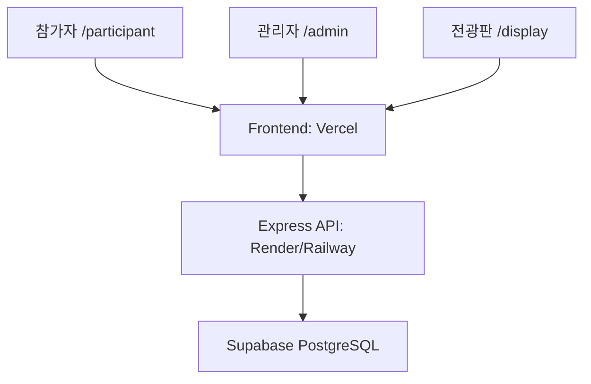

# 인생여전 배포 가이드

## 프로젝트 목표

이 프로젝트는 행사에서 30~40명이 동시에 접속하는 웹 기반 투자 시뮬레이션 플랫폼이다.

배포 후에는 다음 환경에서 모두 정상 동작해야 한다.

- 참가자 휴대폰
- 관리자 노트북
- 전광판 빔프로젝터 또는 TV

모든 사용자는 같은 데이터를 실시간으로 공유해야 한다.

## 기술 스택

### Frontend

- React
- TypeScript
- TailwindCSS
- Recharts
- 배포: Vercel

### Backend

- Node.js
- Express
- Socket.IO
- 배포: Render 또는 Railway

### Database

- Supabase PostgreSQL

## 전체 구조



## 환경변수

### Frontend

Vercel 환경변수:

```env
VITE_API_URL=https://your-api.onrender.com
```

현재 MVP는 프론트엔드에서 Supabase에 직접 연결하지 않고 Express API를 통해서만 DB에 접근한다. 따라서 `SUPABASE_SERVICE_ROLE_KEY`는 절대로 프론트엔드에 넣지 않는다.

### Backend

Render 또는 Railway 환경변수:

```env
PORT=4000
CLIENT_ORIGIN=https://your-app.vercel.app
SUPABASE_URL=https://xxxxx.supabase.co
SUPABASE_SERVICE_ROLE_KEY=xxxxxxxx
```

주의:

- `SUPABASE_SERVICE_ROLE_KEY`는 백엔드 서버에만 등록한다.
- `CLIENT_ORIGIN`에는 실제 Vercel 배포 주소를 넣는다.
- 로컬 개발에서는 `.env.example`을 복사해 `.env`를 만든다.

## Frontend 배포

1. GitHub에 push한다.
2. Vercel에서 프로젝트를 연결한다.
3. 환경변수 `VITE_API_URL`을 입력한다.
4. Deploy를 실행한다.
5. 아래 경로가 열리는지 확인한다.

```txt
/participant
/admin
/display
```

Vercel 설정:

- Build Command: `npm run build`
- Output Directory: `dist`

## Backend 배포

Render 기준:

Build Command:

```bash
npm install
```

Start Command:

```bash
npm start
```

배포 후 확인:

```txt
https://your-api.onrender.com/health
```

응답 예:

```json
{ "ok": true }
```

## Supabase

SQL Editor에서 [supabase/schema.sql](./supabase/schema.sql)을 실행한다.

생성되는 핵심 테이블:

- `users`
- `companies`
- `investments`
- `transactions`
- `game_status`
- `company_value_history`
- `announcements`
- `news`
- `connection_status`
- `salary_rules`
- `final_results`

Seed 데이터:

- 관리자 1명
- 테스트 참가자 30명
- 기업 5개
- 연봉 규칙

행사 전에는 `p001` ~ `p030` 계정을 실제 참가자에게 배정한다. 40명까지 늘릴 때는 `p031`부터 같은 형식으로 추가한다.

## CORS

허용해야 하는 origin:

- 로컬 개발: `http://localhost:5173`
- 배포: Vercel 주소

현재 서버는 `CLIENT_ORIGIN` 값을 기준으로 Express CORS와 Socket.IO CORS를 설정한다.

## 행사 당일 운영

관리자 노트북:

```txt
/admin
```

참가자 휴대폰:

```txt
/participant
```

빔프로젝터 또는 TV:

```txt
/display
```

## 운영 체크리스트

행사 시작 전 확인:

- [ ] 관리자 로그인
- [ ] 참가자 로그인
- [ ] 기업 초기화
- [ ] 연봉 지급 테스트
- [ ] 투자 테스트
- [ ] 정산 테스트
- [ ] 뉴스 테스트
- [ ] 공지 테스트
- [ ] 전광판 확인
- [ ] 그래프 확인
- [ ] 리셋 확인

## 장애 대응

투자가 안 된다:

1. 현재 상태가 `INVESTING` 또는 `REALTIME_ROUND`인지 확인한다.
2. 참가자 현금이 충분한지 확인한다.
3. Render API `/health`를 확인한다.
4. 관리자 화면 최근 거래 로그를 확인한다.

참가자 접속이 안 된다:

1. Vercel 배포 URL을 확인한다.
2. Render API 상태를 확인한다.
3. 휴대폰 네트워크를 확인한다.

전광판이 바뀌지 않는다:

1. `/display` 새로고침을 시도한다.
2. Socket.IO 연결 상태를 확인한다.
3. `/api/state` 응답을 확인한다.
4. Render 서버 로그를 확인한다.

## 성공 기준

배포가 완료되면 다음 항목이 모두 동작해야 한다.

- 참가자 30~40명 접속 가능
- 관리자 정상 운영 가능
- 전광판 정상 표시
- 투자 즉시 반영
- 정산 정상 동작
- 뉴스/공지 정상 발송
- 실시간 그래프 정상 표시
- 기업 1등 엔딩 표시
- 개인 1등 엔딩 표시
